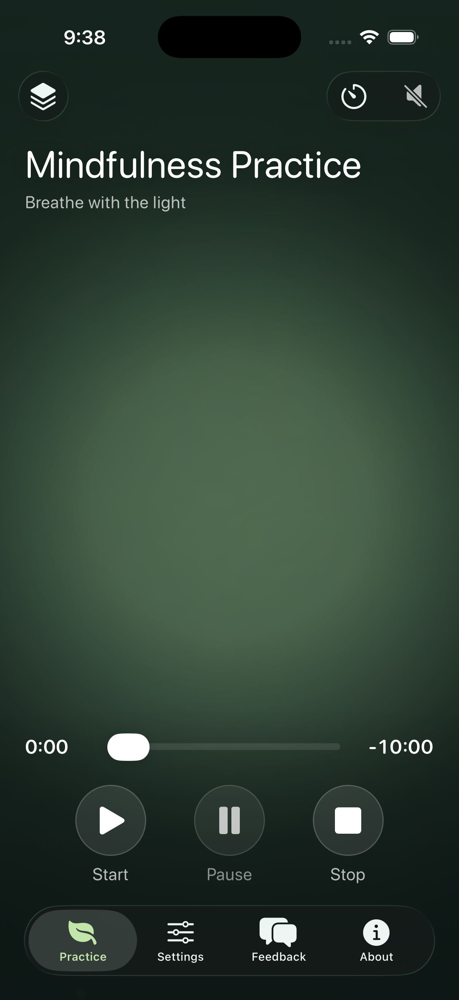

# Mindfulness

A native iOS app for practicing mindfulness — **3 guided meditations** in **4 voices** (English
female/male and 中文 female/male), playing locally on your iPhone behind a calm generative
"aurora" backdrop. Pick a **session** and **length**, choose your **voice**, optionally add
**background music from your own library** (with a volume control), and use simple Start / Pause /
Stop controls with a scrubber. Playback **keeps running when the phone is locked**. No account,
no network, no data collection.



## Tech Stack


- **Swift 6 / SwiftUI** — single-screen declarative UI
- **AVFoundation** — `AVAudioPlayer` for the guided voice plus a looping background-music player
- **MediaPlayer** — `MPMediaPickerController` to pick background music from the user's library
- **XcodeGen** — the Xcode project is generated from [`project.yml`](project.yml)
- **GitHub Actions** — auto-build + sign + submit to the App Store on every push to `main`

## Features

- 🧘 **3 guided meditations** — "Mindfulness Practice" plus 5- and 10-minute Awareness of Breath
- 🗣️ **4 voices** — English female & male (neural), 中文 female & male
- ⏱️ **Adjustable session length** — 5 / 10 / 15 / 20 min, with the closing "wake-up" always
  landing exactly at the chosen time
- 🔒 **Background-safe** — audio continues when the phone locks or the app is backgrounded
- 🎵 **Background music** — play a song from your own library, gently under the voice, with a
  volume control (default 50%)
- ▶️ **Start / Pause / Stop** transport with a draggable progress scrubber
- 📱 **iPhone-only**, portrait, fully offline — nothing leaves the device

## Architecture

Swift files under [`MindfulnessPractice/Sources/`](MindfulnessPractice/Sources/):

| File | Role |
|------|------|
| `MindfulnessPracticeApp.swift` | `@main` entry → `MainTabView` |
| `MainTabView.swift` | Bottom tabs (Practice / Settings / Feedback / About); owns the shared `PracticeSettings` |
| `Catalog.swift` | Data model — sessions (flexible/fixed) + voices; resolves audio file names |
| `PracticeSettings.swift` | `@MainActor` `ObservableObject` persisting session/voice/length/music to `UserDefaults` |
| `PracticeView.swift` | Practice UI — top-nav (session, length, music toggle), scrubber, transport, animated backdrop |
| `PracticePlayerViewModel.swift` | `@MainActor` `ObservableObject` — schedules intro/outro + music on the **audio-device clock** so the session survives backgrounding; handles interruptions |
| `SettingsView.swift` | Voice picker + background-music config (song, volume, enable) |
| `MusicPicker.swift` | `MPMediaPickerController` wrapper; restores a saved song via `persistentID` |
| `MoodAnimationView.swift` | Generative aurora backdrop (drifting colour fields + rising motes) |
| `Theme.swift` | Central color palette (zen sage) |

Playback is driven by hardware time (`AVAudioPlayer.play(atTime:)`), not a foreground `Timer`, so
locking the phone never interrupts the session. For the flexible session the guided silence is
sized at runtime so the closing wake-up lands exactly at the chosen length.

## Build & Run

This project uses [XcodeGen](https://github.com/yonaskolb/XcodeGen) — edit `project.yml`,
never the generated `.pbxproj`.

```bash
xcodegen generate                 # regenerate MindfulnessPractice.xcodeproj
open MindfulnessPractice.xcodeproj # ⌘R in Xcode, or:

xcodebuild -project MindfulnessPractice.xcodeproj \
  -scheme MindfulnessPractice -configuration Debug \
  -destination 'platform=iOS Simulator,name=iPhone 17' build
```

> **Audio:** the 16 narration tracks (3 sessions × 4 voices) live in
> [`MindfulnessPractice/Resources/audio/`](MindfulnessPractice/Resources/audio/) and are
> regenerated by [`scripts/generate_audio.py`](scripts/generate_audio.py). English uses the
> neural on-device TTS [kyutai `pocket-tts`](https://github.com/kyutai-labs/pocket-tts) (female
> voice "anna", male voice-cloned); 中文 uses macOS `say`. All are slowed + warmed + softened
> (atempo, EQ, gentle reverb) in ffmpeg for a calm, unhurried delivery.

## App Store submission & CI/CD

This repo bundles two project-level skills:
[`app-store-submission`](.claude/skills/app-store-submission/) (archive, sign, upload, and submit
via the ASC API + Xcode CLI) and [`ios-auto-release`](.claude/skills/ios-auto-release/) — a GitHub
Actions pipeline ([`.github/workflows/ios-release.yml`](.github/workflows/ios-release.yml)) that
**auto-builds, signs, uploads, and submits to the App Store on every push to `main`**.

## Acknowledgements

Built by [Tertiary Infotech Academy Pte Ltd](https://www.tertiaryinfotech.com/).
